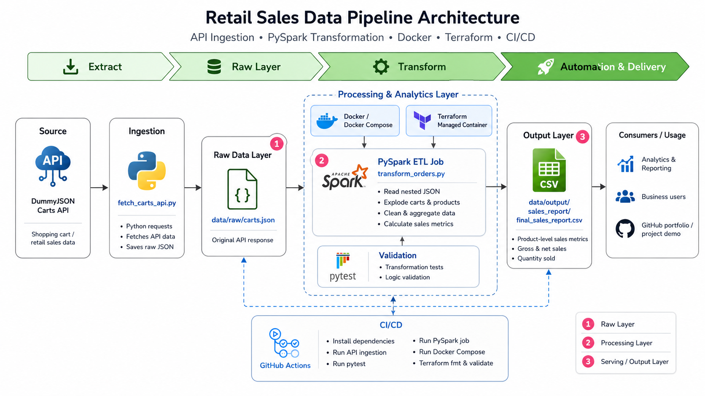

# Retail Sales Data Pipeline

A complete data engineering project that ingests retail cart data from an API, stores the raw response, transforms nested JSON data using PySpark, generates a product-level sales report, and validates the pipeline through Docker, Terraform, and GitHub Actions CI/CD.

---

## Architecture



---

## Problem Statement

Retail sales data is often generated from online carts, APIs, and order systems in a nested or semi-structured format. This raw data is not directly suitable for analytics or reporting.

This project solves that problem by building an automated data pipeline that extracts cart data from an API, stores the original raw JSON, transforms it into a structured format, and produces a clean CSV sales report for analytics and business reporting.

---

## Project Overview

The pipeline follows a simple but practical data engineering workflow:

```text
API Source → Raw JSON Storage → PySpark Transformation → CSV Sales Report → CI/CD Validation
```

The project is designed to demonstrate core data engineering concepts including API ingestion, raw data storage, distributed-style transformation with PySpark, containerized execution, infrastructure-as-code, and automated validation.

---

## Tech Stack

| Technology     | Purpose                                                |
| -------------- | ------------------------------------------------------ |
| Python         | API ingestion and scripting                            |
| PySpark        | Data transformation and aggregation                    |
| Pytest         | Testing transformation logic                           |
| Docker         | Containerized pipeline execution                       |
| Docker Compose | Simplified container orchestration                     |
| Terraform      | Infrastructure as Code for Docker container management |
| GitHub Actions | CI/CD automation                                       |
| GitHub         | Version control and project hosting                    |

---

## Data Source

The project uses the DummyJSON Carts API as the retail data source.

```text
https://dummyjson.com/carts
```

The API provides nested shopping cart data including cart IDs, user IDs, products, prices, quantities, discounts, and total amounts.

---

## Pipeline Workflow

### 1. Data Ingestion

The ingestion script fetches cart data from the API and stores the original response as raw JSON.

```text
src/ingestion/fetch_carts_api.py
```

Raw output:

```text
data/raw/carts.json
```

---

### 2. Data Transformation

The PySpark job reads the raw JSON file, flattens nested cart and product data, cleans the dataset, and calculates product-level sales metrics.

```text
src/jobs/transform_orders.py
```

Main transformation logic includes:

* Reading nested JSON data
* Exploding carts and products arrays
* Flattening product-level fields
* Cleaning missing values
* Aggregating sales by product
* Calculating gross and net sales metrics

---

### 3. Final Output

The transformed report is saved as a CSV file.

```text
data/output/sales_report/final_sales_report.csv
```

Output columns:

| Column                     | Description                            |
| -------------------------- | -------------------------------------- |
| `product_name`             | Product name                           |
| `total_orders`             | Number of carts containing the product |
| `total_quantity_sold`      | Total quantity sold                    |
| `gross_sales`              | Sales before discount                  |
| `net_sales_after_discount` | Sales after discount                   |

---

## Project Structure

```text
retail-sales-data-pipeline/
│
├── .github/
│   └── workflows/
│       └── ci.yml
│
├── assets/
│   └── retail_sales_data_pipeline_architecture.png
│
├── data/
│   ├── raw/
│   │   └── carts.json
│   └── output/
│       └── sales_report/
│
├── src/
│   ├── ingestion/
│   │   └── fetch_carts_api.py
│   └── jobs/
│       └── transform_orders.py
│
├── terraform/
│   └── main.tf
│
├── tests/
│   └── test_transform_orders.py
│
├── docker-compose.yml
├── requirements.txt
├── .gitignore
└── README.md
```

---

## Execution Options

The pipeline can be executed in multiple ways depending on the environment.

### Local Execution

```bash
python src/ingestion/fetch_carts_api.py
python src/jobs/transform_orders.py
```

### Run Tests

```bash
pytest tests/
```

### Docker Compose Execution

```bash
docker compose up
```

### Terraform Execution

```bash
cd terraform
terraform init
terraform validate
terraform apply
```

Terraform manages the Docker-based Spark execution environment using Infrastructure as Code.

---

## Docker and Terraform Usage

Docker is used to run the PySpark pipeline inside a consistent containerized environment using the prebuilt Spark image:

```text
apache/spark:3.5.1-java17-python3
```

Terraform is used to manage the Docker container configuration as code. It defines the Spark image, container name, volume mount, working directory, and Spark execution command.

In this project:

```text
Docker runs the pipeline.
Terraform manages the Docker container using code.
```

---

## CI/CD Pipeline

This project includes a GitHub Actions workflow:

```text
.github/workflows/ci.yml
```

The CI/CD pipeline automatically runs when code is pushed to the `main` branch.

The workflow validates:

* Python dependency installation
* API data ingestion
* PySpark transformation tests
* Local PySpark job execution
* Docker Compose execution
* Terraform formatting and validation

A successful GitHub Actions run confirms that the project works in an automated environment.

---

## Business Value

The final output provides product-level sales metrics that can support:

* Retail sales analysis
* Product performance tracking
* Revenue reporting
* Discount impact analysis
* Business intelligence dashboards
* Portfolio demonstration for data engineering roles

The generated CSV can be used with tools such as Excel, Power BI, Tableau, Looker Studio, or Python analytics notebooks.

---

## Key Features

* API-based retail data ingestion
* Raw JSON data layer
* Nested JSON processing with PySpark
* Product-level sales aggregation
* Automated testing with pytest
* Dockerized Spark execution
* Terraform-managed container infrastructure
* GitHub Actions CI/CD workflow
* Professional project structure for portfolio use

---

## Sample Output

```text
product_name,total_orders,total_quantity_sold,gross_sales,net_sales_after_discount
Protein Powder,1,3,59.97,55.42
Tartan Dress,1,2,79.98,69.62
Oppo K1,1,5,1499.95,1225.61
```

---

## Future Improvements

* Add cloud storage such as AWS S3 for raw and processed data
* Add Apache Airflow for scheduling and orchestration
* Store transformed data in PostgreSQL, Snowflake, or BigQuery
* Add data quality checks
* Build a Power BI or Tableau dashboard
* Deploy infrastructure to AWS using Terraform
* Add logging, monitoring, and error handling

---

## Author

**Saifullah Khan**

GitHub: [itsSaifullahkhan](https://github.com/itsSaifullahkhan)

---

